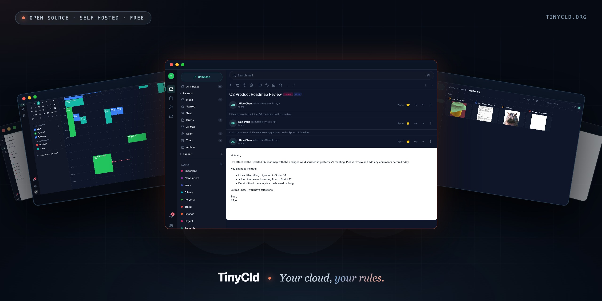

# TinyCld — app shell

<p align="center">
    
</p>

A self-hosted workspace alternative — Expo Router on the front, PocketBase on the
back, every feature shipped as a separately-installable package. See
[tinycld.org](https://tinycld.org) for the full story.

This repo (`tinycld`) is the runnable **app shell**: branding,
Expo native projects, deployment configs, the package generator, and all the heavy
runtime dependencies. It is the entrypoint for `pnpm run dev` and
`docker pull ghcr.io/tinycld/tinycld`.

`@tinycld/core` (the shared TypeScript + Go library) is **part of this repo** — nested at
`core/` (`tinycld/core/`) and imported as `@tinycld/core`. The `tinycld-pkg` CLI
(`@tinycld/package-scripts`) is nested at `package-scripts/`. Feature packages are sibling
repos. The whole tree is one pnpm workspace:

```
~/code/tinycld/
    tinycld/                 # this repo — the app shell (package "tinycld")
        core/                # @tinycld/core (shared lib; nested)
        package-scripts/     # @tinycld/package-scripts — the tinycld-pkg CLI (nested)
    mail/                    # @tinycld/mail (feature package; sibling repo)
    calendar/                # @tinycld/calendar
    contacts/                # @tinycld/contacts
    drive/                   # @tinycld/drive
    text/                    # @tinycld/text
    calc/                    # @tinycld/calc
    google-takeout-import/   # @tinycld/google-takeout-import
```

Everything imports core as `@tinycld/core/*` (and `tinycld.org/core` for Go); resolution
is by the pnpm `node_modules/@tinycld/core` symlink (Metro), tsconfig `paths` (typecheck),
vitest aliases (tests), and a Go `replace` directive (server).

## Getting a working tree

This repo is one member of a workspace, not a standalone clone target. Let
`@tinycld/bootstrap` assemble the workspace root and clone this `tinycld` repo
(which carries `@tinycld/core` + `@tinycld/package-scripts` nested) — it writes the
workspace coordination files (`package.json`, `tinycld.packages.ts`, shared test
stubs) from embedded templates and clones each member as a sibling directory:

```sh
mkdir ~/code/tinycld && cd ~/code/tinycld
npx @tinycld/bootstrap@latest --assemble-only --with mail --with contacts
pnpm install        # links members + runs the generator (postinstall)
cd tinycld && pnpm run dev
```

Full guide: <https://tinycld.org/docs/getting-started>.

To add another feature to an existing workspace, either re-run
`npx @tinycld/bootstrap@latest --assemble-only --with <slug>` (skips dirs that
already exist) or `git clone` the sibling repo by hand into the workspace root,
then `pnpm install` again.

`pnpm run dev` runs three processes in parallel: an HTTP proxy on the user-facing port
7100, the Go PocketBase server on 7101, and the Expo bundler on 7102. The proxy routes
`/api` and `/_` to PB and everything else to Expo, so the app talks to PB same-origin.

If `assets/localhost.pem` + `assets/localhost-key.pem` are present, the proxy serves
TLS — visit `https://localhost:7100`. Otherwise it's plain HTTP at `http://localhost:7100`.
SSL is needed for developing on the iOS simulator; trust the certs via the Settings app.

```sh
brew install mkcert     # macOS — see mkcert docs for other platforms
mkcert -install         # one-time, installs the local CA in your trust store
pnpm run ssl:generate
```

## What's where

- **`app/`** — Expo Router route tree. `_layout.tsx` calls `configureCore(appConfig)` first, then
  imports core's Providers and mounts the gate.
- **`lib/app-config.ts`** — `CoreConfig` value handed to core at boot. Branding, server
  shortcuts, Sentry creds, review-mode flags.
- **`lib/configure-core.ts`** — side-effect-only module imported first by `_layout.tsx` so
  `configureCore` runs before any other `@tinycld/core/*` import.
- **`tinycld.config.ts`** — generated source of truth for installed packages (a typed
  `definePackageEntry` array). Core derives stores/sidebars/providers/registry/seeds from it
  at runtime. Gitignored.
- **`tinycld.seeds.ts`** — generated Node-only seed list, kept out of the app bundle. Gitignored.
- **`lib/generated/`** — generator output: `tinycld-config.ts` shim, `package-help.ts`,
  `uniwind-sources.css`. Gitignored.
- **`scripts/generate.ts` + `scripts/gen-*.ts`** — the lean generator. Walks the workspace
  members with a `manifest.ts` (via `../tinycld.packages.ts`), writes route re-exports,
  `tinycld.config.ts`/`tinycld.seeds.ts`, help, uniwind sources, PocketBase migration/hook
  symlinks, and the Go server wiring. Runs on `postinstall`.
- **`scripts/dev.ts`** — the dev launcher (proxy + PB + Expo).
- **`server/main.go`** — load env, init Sentry, build `coreserver.Options`, call
  `coreserver.Register(app, opts)`. Module `tinycld.org/tinycld` with
  `replace tinycld.org/core => ../core/server`.
- **`server/pb_migrations/`, `server/pb_hooks/`** — landing dirs for symlinks the generator
  populates from core's `server/` plus each linked feature package.
- **`Dockerfile`, `docker-compose.yml`, `eas.json`** — deployment.

## Adding / removing feature packages

There is no `packages:link`/`packages:install` step — linking is the pnpm workspace install.
`pnpm-workspace.yaml`'s `packages:` list already enumerates every known first-party feature, so
adding one is just cloning the sibling and re-installing. The fastest path is bootstrap:

```sh
cd ~/code/tinycld
npx @tinycld/bootstrap@latest --assemble-only --with <slug>
pnpm install        # links it + regenerates
```

Or by hand:

```sh
cd ~/code/tinycld
git clone git@github.com:tinycld/<slug>.git <slug>
pnpm install        # links it + regenerates
```

For a third-party package, also add its directory name to the `packages:` list in
the workspace-root `pnpm-workspace.yaml` before installing.

Remove one by deleting its sibling clone and re-running `pnpm install`. The set of
linked packages = the set of installed workspace members.

## Working in this repo

```sh
cd ~/code/tinycld && pnpm install   # at the workspace root (postinstall runs the generator)
cd tinycld
pnpm run checks                     # biome + tsc
pnpm run test                       # vitest (this member)
pnpm run test:e2e                   # playwright (this member)
cd server && go build -o tinycld . && ./tinycld --help
```

Per-member checks run via the `tinycld-pkg` CLI (`@tinycld/package-scripts`): from any
member dir, `pnpm exec tinycld-pkg check` typechecks + unit-tests just that member;
`tinycld-pkg check --all` runs every member (the `tinycld` shell, core, and each feature sibling).

## Code style

See [CONTRIBUTING.md](CONTRIBUTING.md) for conventions — no `useState`/`useEffect` shortcuts,
semantic Tailwind tokens, pbtsdb for data, etc.

## Deploy

```sh
docker pull ghcr.io/tinycld/tinycld
```

The image bakes the Go binary, Expo web export, PocketBase server, and the
[mail](https://github.com/tinycld/mail),
[calendar](https://github.com/tinycld/calendar),
[contacts](https://github.com/tinycld/contacts),
[drive](https://github.com/tinycld/drive), and
[google-takeout-import](https://github.com/tinycld/google-takeout-import)
packages into one container.
[text](https://github.com/tinycld/text) and [calc](https://github.com/tinycld/calc)
are available but not bundled by default — clone them as siblings and re-install to
include them in your own image build.
Healthchecks and Let's Encrypt-friendly cert handling are baked in. Dokku one-liner deploys
work via `app.json` + the `Dockerfile`.

## License

[AGPL-3.0](LICENSE). Commercial relicensing available — open an issue to discuss.
